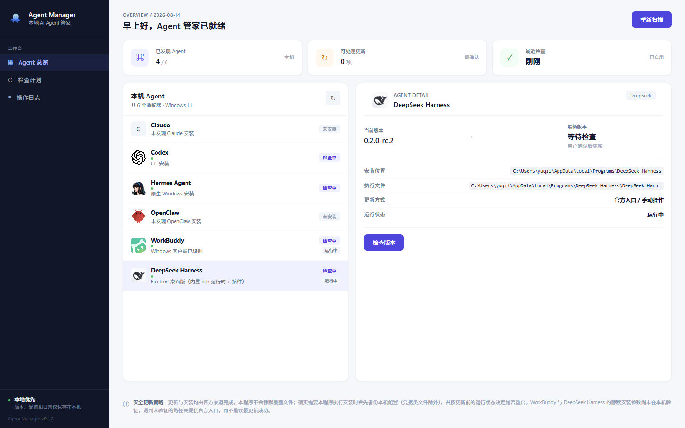

# Agent Manager

**Discover, version-check and update the AI coding agents installed on your Windows machine.**

English · [中文说明](README.zh-CN.md) · Author: **Kirin** · [MIT License](LICENSE)




## Why

AI coding agents ship fast and install in a dozen different ways — Microsoft Store (AppX), winget, npm, plain installers, or their own built-in updater. Figuring out which ones you have, what version they are, and whether you missed an update means running `--version` by hand and hunting through websites.

Agent Manager scans your machine once and shows all of it in one window.

## Supported agents

| Agent | How it finds the install | Current version from | Update check |
|---|---|---|---|
| Claude | AppX, running process, uninstall registry, known paths, deep scan | embedded version / install path | winget `Anthropic.Claude` |
| Codex | AppX, CLI install under `%LOCALAPPDATA%\OpenAI\Codex`, running process | `codex --version` | winget `OpenAI.Codex` |
| Hermes Agent | recursive scan under `%LOCALAPPDATA%\hermes` | `hermes --version` (date-based version) | GitHub releases |
| OpenClaw | npm global shims | `openclaw --version` | npm registry |
| WorkBuddy | uninstall registry, Program Files, `%LOCALAPPDATA%` | uninstall registry `DisplayVersion` | winget `Tencent.WorkBuddy` |
| DeepSeek Harness | uninstall registry (the key is a random GUID) | uninstall registry `DisplayVersion` | official update feed (`nightly`) |

## Features

- Detects installed agents and shows install path, executable and running state
- One version-detection chain for every agent: program self-report → uninstall registry → embedded PE version → install path
- Update checks against each vendor's real source: winget, npm, GitHub releases, or the vendor's own update feed
- Install assistance: run a winget package, download the official installer to a folder you choose, or open the official download page
- Headless daily check through Windows Task Scheduler, reported by a desktop notification
- Local-first: state and logs stay in `%APPDATA%\AgentManager`, nothing is uploaded

## Download

Grab the latest installer from [**Releases**](https://github.com/ruiyukirin/agent-manager/releases):

| File | What it is |
|---|---|
| `Agent.Manager_<version>_x64-setup.exe` | NSIS installer — recommended |
| `Agent.Manager_<version>_x64_en-US.msi` | MSI package |

**Requirements:** Windows 10 or 11 (x64). WebView2 runtime — already present on Windows 11 and current Windows 10.

## Limitations (v0.1.x)

Agent Manager is honest about what it does not do yet:

- **Windows only.** Detection uses the Windows registry, `tasklist`, `schtasks` and `winget`.
- **The first scan takes tens of seconds.** Every agent needs registry lookups, process checks and `--version` probes; the list fills in as soon as the scan finishes.
- **Updates are reported, not applied in place.** Each row tells you the exact command to run or opens the official download page. The app never silently overwrites your agent files.
- **Some silent-install flags are not verified end to end yet.** When a vendor's installer cannot be verified, the app opens the official download page instead of claiming success.
- **The pre-update config backup only runs for agents whose update actually modifies files** — today that is none of them, so it effectively does not run.

## Development

```bash
npm install
npm run tauri dev
```

Build and test:

```bash
npm run build        # type-check the frontend and build it
npm test             # frontend tests (none yet)
npm run check-version
cd src-tauri && cargo test
```

Frontend: React + TypeScript + Vite. Backend: Rust + Tauri 2. Each agent lives in its own adapter under `src-tauri/src/adapters/`.

## License

MIT © 2026 Kirin
